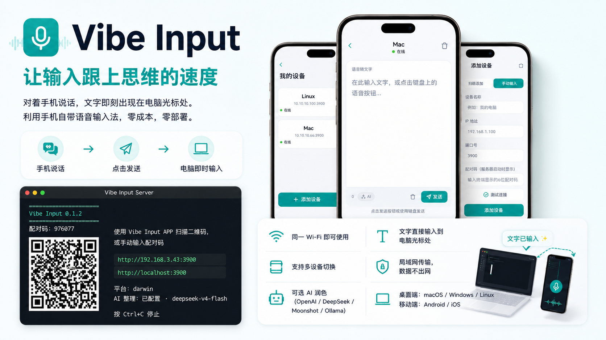
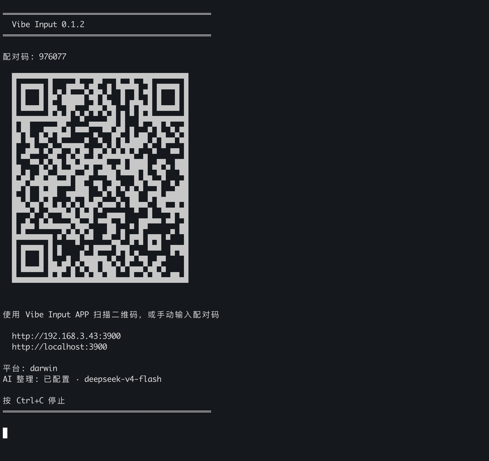
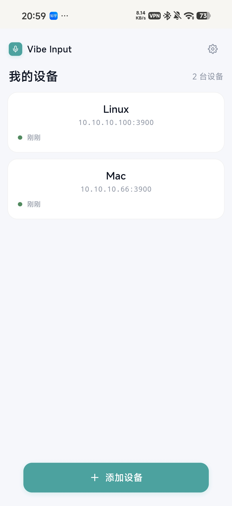
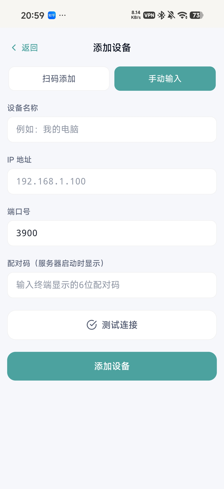
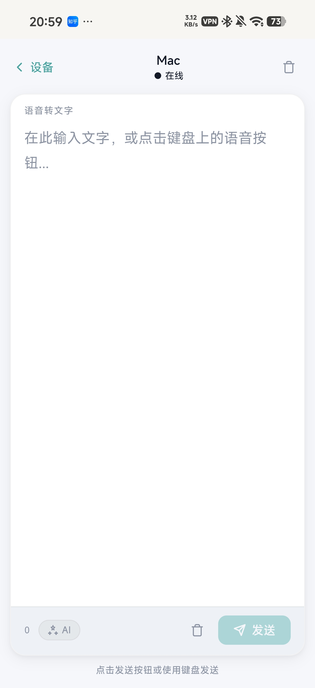

# Vibe Input

> 让输入跟上思维的速度

[](./LICENSE)
[](https://nodejs.org)

---

Vibe Input 是一个为 Vibe Coding 场景打造的跨平台语音输入工具。

对着手机说话，文字即刻出现在电脑光标处。利用手机自带语音输入法，零成本，零部署。



---

## 为什么需要 Vibe Input

Vibe Coding 的核心是用自然语言向 AI Agent 下达指令，让 AI 来完成编码。这个过程中，你大部分时间不是在写代码，而是在**描述需求、拆解任务、给出反馈**——本质上是在和 AI 对话。

但问题在于，我们和 AI 对话的方式仍然是打字。大脑的思维速度远超手指的敲击速度，"想到 → 组织语言 → 敲出来 → 再想下一步"这个循环会不断打断心流。经常是话还没敲完，脑子里下一句已经忘了。

**说话才是最自然的思考方式。** 语音输入让你能够：

- **保持心流** — 不用在"想"和"敲"之间来回切换，一口气把需求说完
- **表达更完整** — 说出来的指令比逐字敲出来的更自然，上下文更丰富
- **速度翻倍** — 大多数人说话速度是打字的 3-5 倍，AI 等你的时间也更短

Vibe Input 做的事情很简单：你对着手机说出对 AI 的需求，文字直接出现在电脑光标位置。不需要复制粘贴，不需要扫码登录，不需要上传到云端。手机和电脑在同一个 WiFi 下，说完就发送，文字即时上屏。

---

## 预览

<div align="center">
  
</div>

<div align="center">
  
  
  
</div>


---

## 特性

**零成本语音输入** — 利用手机自带语音输入法，无需部署模型或调用付费 API。

**即时上屏** — 点击发送，文字立即复制到剪贴板并粘贴到电脑当前焦点位置。

**纯局域网** — 手机电脑连接同一 WiFi 即可使用，数据不出局域网，无需互联网。

**原生 APP** — 使用 Capacitor 打包为 Android/iOS 原生应用，体验流畅。

**多设备管理** — 一台手机可连接多台电脑，在设备列表间自由切换发送目标。

**扫码配对** — 扫描终端二维码快速添加设备，也支持手动输入 IP 和配对码。

**AI 整理** — 接入 LLM（OpenAI / DeepSeek / Moonshot / Ollama），对语音输入的口语化文字进行智能整理润色，结果可编辑后发送。

**安全设计** — 配对令牌认证、时序安全比较、Prompt Injection 防御、Rate Limiting、配置文件权限保护。

**跨平台** — 桌面端支持 macOS / Windows / Linux，手机端支持 Android 8.0+ / iOS 14+。

---

## 快速开始

### 环境要求

- 电脑：Node.js 18+
- 手机：Android 8.0+ 或 iOS 14+
- 网络：手机与电脑在同一局域网

### 安装与启动

**方式一：npm 全局安装（推荐）**

```bash
npm install -g vibe-input
vibe-input
```

**方式二：从源码运行**

```bash
git clone https://github.com/MarkYangKp/vibe-input.git
cd vibe-input
npm install
npm run dev
```

启动后终端显示二维码和配对码：

```
══════════════════════════════════════════════
  Vibe Input 0.1.3
══════════════════════════════════════════════

配对码: 482951

  █▀▀▀▀▀█  █ ▄▀█  ▀█▀▄▀█  █▀▀▀▀▀█
  █ ███ █  ▀█▀ ▀ ▀▀▄▀ ▀▀█  █ ███ █
  █ ▀▀▀ █   ▀▄▀▄▀▄ ▄▀█▀▀▄  █ ▀▀▀ █
  ▀▀▀▀▀▀▀ ▀ █▄▀ █▄▀ █▄▀ ▀ ▀▀▀▀▀▀▀
  ▀▀▄▀█▄ █▀▄ █▀▀██▄█▄▀▄▀█▄▀▄ ▀▀▄█
  ...（扫描此二维码配对）

使用 Vibe Input APP 扫描二维码，或手动输入配对码

  http://192.168.1.100:3900
  http://localhost:3900

平台: darwin
AI 整理: 已配置 · gpt-4o-mini

按 Ctrl+C 停止
══════════════════════════════════════════════
```

### 构建手机 APP

```bash
npm run build:app    # 构建
npm run cap:sync     # 同步到 Capacitor
npm run cap:android  # 在 Android Studio 中打开
npm run cap:ios      # 在 Xcode 中打开（仅 macOS）
```

### 使用流程

1. 电脑端启动服务器，终端显示二维码和6位配对码
2. 手机端打开 APP，扫描终端二维码或手动输入配对码
3. 手机端语音输入文字
4. 点击发送，文字粘贴到电脑光标位置

---

## 使用场景

| 场景 | 说明 |
|------|------|
| Vibe Coding | 向 AI 描述需求时，用说的代替打字，思维不打断 |
| 灵感记录 | 走路、做家务时随时对着手机说出想法 |
| 消息回复 | 不方便打字时，语音输入快速回复消息 |
| 长篇内容 | 邮件、文档等长篇内容，用说的效率更高 |
| 多电脑切换 | 一台手机在工位和会议室电脑间自由切换 |

---

## 工作原理

1. **启动** — 运行 `npm run dev`，电脑端监听 3900 端口，终端显示二维码和6位配对码
2. **连接** — 手机 APP 扫描终端二维码或手动输入配对码，建立认证连接
3. **输入** — 手机端使用系统语音输入法，将语音转为文字
4. **整理**（可选）— 开启 AI 整理后，文字先经 LLM 润色，用户确认后再发送
5. **上屏** — 服务器将文字写入剪贴板，模拟 `Ctrl+V` / `Cmd+V` 粘贴到当前焦点窗口

---

## 手机 APP

**设备管理**

- 扫码配对：扫描桌面端二维码自动获取连接信息
- 手动添加：支持手动输入 IP 地址和端口
- 设备列表：查看已添加设备，实时显示在线状态
- 快速切换：在多台电脑间一键切换发送目标

**文本输入**

- 语音输入：调用手机系统输入法的语音功能
  > 推荐搭配 **豆包输入法** 使用，其语音识别精准度业界领先，转写准确率高，体验最佳。
- AI 整理：对口语化文字进行智能润色
- 结果预览：AI 整理结果弹窗展示，支持编辑后发送
- 快捷键：`Ctrl+Enter` 或 `Cmd+Enter` 快捷发送

**个性化**

- 主题切换：浅色模式 / 深色模式 / 跟随系统
- AI 开关：随时启用或禁用 AI 整理功能

---

## 桌面端

纯 API 服务器，启动后在终端显示二维码和6位配对码。手机 APP 扫码或手动输入配对码即可连接。支持剪贴板粘贴、AI 整理代理、设备认证等全部功能。

---

## 系统要求

### 桌面端

| 平台 | 要求 |
|------|------|
| macOS | 需授予终端**辅助功能**权限（系统设置 → 隐私与安全性 → 辅助功能） |
| Windows | 建议**以管理员身份**运行终端 |
| Linux | 需安装 `xdotool` 和 `xclip` |

Linux 工具安装：

```bash
# Debian / Ubuntu
sudo apt install xdotool xclip

# Arch Linux
sudo pacman -S xdotool xclip

# Fedora
sudo dnf install xdotool xclip
```

macOS 权限设置步骤：

1. 打开**系统设置** → **隐私与安全性** → **辅助功能**
2. 点击 **+** 添加终端应用（Terminal / iTerm2）
3. 确保应用右侧开关已开启
4. 重启终端应用

### 手机端

- Android 8.0+ 或 iOS 14+
- 与电脑在同一局域网

---

## 配置

### LLM 配置

配置文件位置：`~/.vibe-input/config.json`

首次运行 `npm run dev` 时自动启动交互式配置向导，也可手动编辑：

```json
{
  "llm": {
    "baseUrl": "https://api.openai.com/v1",
    "apiKey": "sk-xxxxxx",
    "model": "gpt-4o-mini",
    "prompt": "",
    "enabled": true
  }
}
```

| 字段 | 类型 | 说明 |
|------|------|------|
| `baseUrl` | string | OpenAI 兼容 API 地址 |
| `apiKey` | string | API 密钥 |
| `model` | string | 模型名称 |
| `prompt` | string | 自定义系统提示词（留空使用内置默认） |
| `enabled` | boolean | 是否启用 AI 整理 |

自定义提示词也可放在 `~/.vibe-input/prompt.txt`，内容会自动加载。

### 支持的 LLM

| 服务商 | baseUrl | 推荐模型 |
|--------|---------|----------|
| OpenAI | `https://api.openai.com/v1` | `gpt-4o-mini` |
| DeepSeek | `https://api.deepseek.com/v1` | `deepseek-chat` |
| Moonshot | `https://api.moonshot.cn/v1` | `moonshot-v1-8k` |
| Ollama (本地) | `http://localhost:11434/v1` | `qwen2.5:7b` |

### 自定义端口

```bash
npm run dev -- --port 4000
# 或
PORT=4000 npm run dev
```

### 调试模式

```bash
VIBE_INPUT_DEBUG=1 npm run dev
```

---

## API

除 `/api/health` 和 `/api/qrcode` 外，所有端点需要 `X-Pairing-Token` 请求头。

| 端点 | 方法 | 认证 | 限流 | 说明 |
|------|------|------|------|------|
| `/api/health` | GET | — | — | 健康检查 |
| `/api/qrcode` | GET | — | — | 二维码图片（PNG） |
| `/api/type` | POST | 是 | 30/min | 粘贴文本到电脑 |
| `/api/polish` | POST | 是 | 10/min | AI 整理文本 |
| `/api/config` | GET | 是 | — | 获取 LLM 配置 |
| `/api/config` | POST | 是 | 5/min | 更新 LLM 配置 |

### 健康检查

```bash
curl http://192.168.1.100:3900/api/health
```

```json
{
  "ok": true,
  "platform": "darwin",
  "uptime": 123.45,
  "port": 3900,
  "ip": "192.168.1.100",
  "name": "电脑 (192.168.1.100)"
}
```

### 发送文本

```bash
curl -X POST http://192.168.1.100:3900/api/type \
  -H "Content-Type: application/json" \
  -H "X-Pairing-Token: <令牌>" \
  -d '{"text": "要粘贴的文字"}'
```

```json
{ "ok": true }
```

### AI 整理

```bash
curl -X POST http://192.168.1.100:3900/api/polish \
  -H "Content-Type: application/json" \
  -H "X-Pairing-Token: <令牌>" \
  -d '{"text": "我想说的是那个嗯..."}'
```

```json
{ "ok": true, "text": "我想说的是那个..." }
```

### 获取 LLM 配置

```bash
curl http://192.168.1.100:3900/api/config \
  -H "X-Pairing-Token: <令牌>"
```

```json
{ "llm": { "enabled": true, "configured": true, "model": "gpt-4o-mini" } }
```

### 更新 LLM 配置

```bash
curl -X POST http://192.168.1.100:3900/api/config \
  -H "Content-Type: application/json" \
  -H "X-Pairing-Token: <令牌>" \
  -d '{"model": "deepseek-chat", "baseUrl": "https://api.deepseek.com/v1"}'
```

---

## 项目结构

```
vibe-input/
├── app/                    # 手机APP（React + Vite + Capacitor 6）
│   ├── src/
│   │   ├── components/    # 可复用 UI 组件
│   │   ├── pages/         # 页面级组件
│   │   ├── hooks/         # 自定义 Hooks
│   │   ├── services/      # API 和存储
│   │   ├── store/         # 全局状态管理
│   │   ├── App.tsx        # 根组件
│   │   ├── main.tsx       # 入口文件
│   │   └── styles.css
│   └── package.json
├── server/                 # 桌面端 Node.js 服务器（纯 API）
│   ├── src/
│   │   ├── vibe-input.ts  # HTTP 服务器入口
│   │   ├── config.ts      # 配置管理
│   │   ├── llm.ts         # LLM API 调用
│   │   ├── setup.ts       # CLI 配置向导
│   │   └── prompt.txt     # 默认系统提示词
│   └── package.json
├── shared/                 # 共享类型定义
│   └── types.ts
├── bin/
│   └── vibe-input.mjs     # CLI 入口脚本
├── docs/
│   └── images/            # 文档图片资源
├── README.md
├── CONTRIBUTING.md
└── LICENSE
```

---

## 开发

```bash
# 启动开发服务器
npm run dev

# 类型检查
npm run typecheck

# 代码检查
npm run lint

# 运行测试
npm test

# 构建
npm run build
npm run build:server
npm run build:app
```

详细开发规范见 [CONTRIBUTING.md](./CONTRIBUTING.md)。

---

## 常见问题

**手机无法连接电脑**

1. 确认手机和电脑连接同一 WiFi（注意 2.4G 和 5G 频段）
2. 检查电脑防火墙是否阻止了 3900 端口
3. 确认终端显示的 IP 是局域网 IP（`192.168.x.x` 或 `10.x.x.x`）
4. 尝试在手机浏览器访问 `http://<电脑IP>:3900/api/health` 测试连通性

**macOS 粘贴不生效**

1. 打开系统设置 → 隐私与安全性 → 辅助功能
2. 确保终端应用（Terminal / iTerm2）在列表中且已勾选
3. 如不在列表中，点击 + 手动添加后重启终端

**AI 整理不工作**

1. 检查 `~/.vibe-input/config.json` 中 `apiKey` 是否正确填写
2. 检查 `baseUrl` 是否可访问
3. 开启调试模式：`VIBE_INPUT_DEBUG=1 npm run dev`

**APP 无法安装**

- Android：在系统设置中允许"安装未知来源应用"
- iOS：需通过 Xcode 进行开发签名后安装到设备

---


## 贡献

欢迎贡献。请先阅读 [CONTRIBUTING.md](./CONTRIBUTING.md)。


---

## 许可证

[MIT License](./LICENSE)

---

## 致谢

感谢所有为 Vibe Input 贡献代码和使用反馈的开发者。

如果这个项目对你有用，欢迎 Star。

---

> 让输入跟上思维的速度
